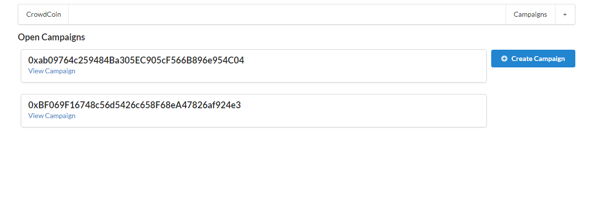

# Lottery Smart Contract

Smart contract project built in the Rinkeby Test Network for Ethereum. The smart contract has the enter, getPlayers, random and pickWinner methods and the manager and players properties. A player having a Metamask wallet in the Rinkeby Network and with some ethereum on that network (so it would be test ether) can enter the contract and once the contract has one or more playes only the manager of the contract can send the pickWinner method call through the pick a winner! button, once the pickWinner method is called, in a pseudo random way a player will be choosen as the winner getting all the balance in the smart contract. A very basic frontend was build to interact with the contract.

## Built With

- Solidity 0.4.17
- Javascript
- React
- ReactDOM
- Web3 1.0.0-beta.26
- Rinkeby Test Network
- Metamask Wallet

## Author

- 👤GitHub: [Jose Abel Ramirez](https://github.com/jose-Abel)
- Linkedin: [Jose Abel Ramirez Frontany](https://www.linkedin.com/in/jose-abel-ramirez-frontany-7674a842/)

## Getting Started

To test this smart contract, once cloned the repo, run npm install in the root directory, also run npm install inside lottery contract directory as well. Inside lottery contract directory run node deploy.js, copy the address and the interface code that shows in the terminal and paste that code inside src/lottery.js, the address replacing the value of the address const variable and the interface replacing the value of the abi const variable. That is so the machine cloning this repo will be the manager of the contract so it can test the pickWinner method call.

## Live version

https://jose-abel-lottery-smart-contract.netlify.app/

### Setup

## 📝 License

This project is MIT licensed.

## Show your support

Give a ⭐️ if you like this project!
